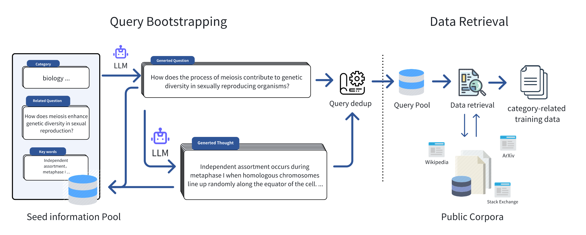

# Query of CC

[📄 Paper](https://arxiv.org/abs/2401.14624) |
[🤗 HuggingFace](https://huggingface.co/datasets/Query-of-CC/Knowledge_Pile) |
[📝 DataSheet](./datasheet-for-knowledgepile.md)

This project is dataset and model checkpoints for the paper "Query of CC: Unearthing Large Scale Domain-Specific Knowledge from Public Corpora".

## Update

[2024.3.5] We have released the complete Knowledge Pile dataset at https://huggingface.co/datasets/Query-of-CC/knowledge_pile_full/. We also fixed some statistical errors. We have a total of 735GB disk size and 188B billion tokens(using Llama2 tokenizer) in Knowledge Pile.

[2024.2.21] We have released partial data of Knowledge Pile at https://huggingface.co/datasets/Query-of-CC/Knowledge_Pile.

[2024.1.26] We have released our paper at https://arxiv.org/abs/2401.14624.

## Introduction

We propose an efficient data collection method *Query of CC* based on large language models (see the figure below). This method bootstraps seed information through a large language model and retrieves related data from public corpora. It not only collects knowledge-related data for specific domains but unearths the data with potential reasoning procedures. Through the application of this method, we have curated a high-quality dataset called **Knowledge Pile**, encompassing four major domains, including stem and humanities sciences, among others. 



## *Query of CC*

Just like the figure below, we initially collected seed information in some specific domains, such as keywords, frequently asked questions, and textbooks, to serve as inputs for the Query Bootstrapping stage. Leveraging the great generalization capability of large language models, we can effortlessly expand the initial seed information and extend it to an amount of domain-relevant queries. Inspiration from Self-instruct and WizardLM, we encompassed two stages of expansion, namely **Question Extension** and **Thought Generation**, which respectively extend the queries in terms of breadth and depth, for retrieving the domain-related data with a broader scope and deeper thought. Subsequently, based on the queries, we retrieved relevant documents from public corpora, and after performing operations such as duplicate data removal and filtering, we formed the final training dataset. 


## **Knowledge Pile** Statistics

Based on *Query of CC* , we have formed a high-quality knowledge dataset **Knowledge Pile**, which maintains about 735GB disk and 188B tokens~(using Llama2 tokenizer). As shown in Figure below, comparing with other datasets in academic and mathematical reasoning domains, we have acquired a large-scale, high-quality knowledge dataset at a lower cost, without the need for manual intervention. Through automated query bootstrapping, we efficiently capture the information about the seed query. **Knowledge Pile**~not only covers mathematical reasoning data but also encompasses rich knowledge-oriented corpora spanning various fields such as biology, physics, etc., enhancing its comprehensive research and application potential.


 


This table presents the top 10 web domains with the highest proportion of **Knowledge Pile**, primarily including academic websites, high-quality forums, and some knowledge domain sites. Table~\ref{fig:queryofcc_timestamp} provides a breakdown of the data sources' timestamps in **Knowledge Pile**, with statistics conducted on an annual basis. It is evident that a significant portion of **Knowledge Pile**~is sourced from recent years, with a decreasing proportion for earlier timestamps. This trend can be attributed to the exponential growth of internet data and the inherent timeliness introduced by the **Knowledge Pile**.

| **Web Domain**       | **Count** |
|----------------------------|----------------|
|en.wikipedia.org | 398833 |
|www.semanticscholar.org | 141268 |
|slideplayer.com | 108177 |
|www.ncbi.nlm.nih.gov | 97009 |
|link.springer.com | 85357 |
|www.ipl.org | 84084 |
|pubmed.ncbi.nlm.nih.gov | 68934 |
|www.reference.com | 61658 |
|www.bartleby.com | 60097 |
|quizlet.com | 56752 |


## Cite

```
@article{fei2024query,
  title={Query of CC: Unearthing Large Scale Domain-Specific Knowledge from Public Corpora},
  author={Fei, Zhaoye and Shao, Yunfan and Li, Linyang and Zeng, Zhiyuan and Yan, Hang and Qiu, Xipeng and Lin, Dahua},
  journal={arXiv preprint arXiv:2401.14624},
  year={2024}
}
```
